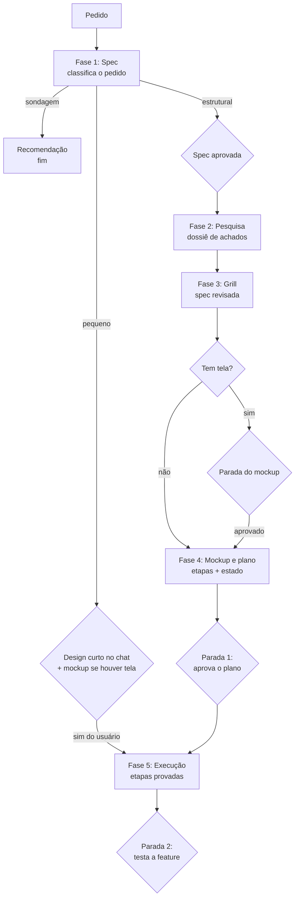

# Vesta

Uma skill do Claude Code que leva um pedido cru até uma feature pronta passando por cinco fases,
com paradas em que você aprova e uma trava que não deixa o agente declarar pronto sem prova.

## O que a Vesta resolve

Sem um fluxo, o agente costuma errar sempre nos mesmos pontos. Cada fase da Vesta existe para
um deles:

- **Pula direto para o código.** A fase **Spec** obriga a entender o resultado pretendido, para
  quem é e o que conta como sucesso, e só segue com a sua aprovação.
- **Interroga sem ter pesquisado.** A fase **Pesquisa** varre o repositório e a web antes, e cada
  achado vira munição para as perguntas.
- **Aceita a spec como veio.** O **Grill** questiona cada decisão contra o que a pesquisa achou e
  corrige a spec na hora.
- **A tela só aparece depois de construída.** Em **Mockup e plano**, tudo que tem tela ganha um
  mockup em HTML aprovado antes de qualquer código.
- **Declara pronto sem teste e para no meio.** Na **Execução**, cada etapa precisa de um teste
  que falha antes e passa depois, provado por um script, e um hook não deixa a sessão parar
  enquanto houver etapa sem prova.

## Como o fluxo anda



A fase Spec classifica o pedido em um de três caminhos, e a classificação só sobe:

- **sondagem**: pergunta de viabilidade. Termina numa recomendação; o que se constrói para
  descobrir é descartável.
- **pequeno**: mudança pequena num fluxo que já existe no repositório. Design curto no chat,
  sim explícito, e vai direto à execução com uma etapa só. Se houver algo visível, o mockup vem
  junto e o mesmo sim aprova os dois.
- **estrutural**: projeto ou subsistema novo, ou mudança numa interface de que outros dependem.
  Passa pelas cinco fases.

Cada fase é um arquivo em `skill/`, lido só na hora de entrar nela. O roteiro geral está em
`skill/SKILL.md`.

### Spec

Fonte: `skill/spec.md`. Entrada: o pedido. O agente olha o projeto, faz uma pergunta por vez,
propõe duas ou três abordagens e escreve o design em seções. Saída: a spec em
`docs/vesta/specs/`, commitada. Para até você aprovar o arquivo.

### Pesquisa

Fonte: `skill/research.md`. Entrada: a spec. Roda em paralelo até três agentes no repositório
(reuso, documentação, blast radius), um agente na web (prior art, armadilhas, doc oficial) e, se
houver tela, o inspo para referências visuais. Saída: o dossiê em `docs/vesta/research/`, com
fonte em cada achado e a fila do grill, ordenada por dependência. Não para: segue direto.

### Grill

Fonte: `skill/grill.md`. Entrada: spec e dossiê. Uma pergunta por vez, na ordem da fila, cada
uma com a resposta recomendada e escrita em consequência para você, não em nome de função.
Saída: a spec corrigida na hora a cada decisão, com a seção `## Decisões do grill`. Para quando
a fila esvazia e você confirma que não há galho aberto.

### Mockup e plano

Fontes: `skill/mockup.md` e `skill/plano.md`. Entrada: a spec revisada. Com tela, primeiro um
mockup feito com a vesta-interface e referências do inspo (rota do app no React, HTML
autocontido fora dele), com a página commitada em `docs/vesta/mockups/`, e a **parada do
mockup** espera o seu sim. Depois o plano em `docs/vesta/plans/`: etapas da mais simples à mais complexa, cada uma com arquivos, o que prova
e como fazer, e o estado da execução criado pelo script. Para na **parada 1**: você aprova o
plano.

### Execução

Fonte: `skill/execucao.md`. Entrada: o plano aprovado. Para cada etapa, um subagente escreve os
testes, que são commitados e precisam falhar (`prova vermelho`); outro implementa, commita, e
os testes precisam passar (`prova teste`); só então a etapa é concluída. O script
`skill/scripts/vesta.py` confere cada prova e trava a etapa depois de tentativas demais, e os
hooks de `skill/hooks/hooks.json` não deixam a sessão parar no meio. Saída: um commit de teste
e um de implementação por etapa. Para na **parada 2**: você testa a feature.

Para os detalhes: [como funciona por dentro](docs/como-funciona.md), [dependências](docs/dependencias.md) e [limites conhecidos](docs/limites.md).

## Exemplo de ponta a ponta

Este repositório foi criado pela própria Vesta, pelo caminho estrutural. Os artefatos estão em
`docs/exemplo/`.

**Spec** (`docs/exemplo/spec.md`), o objetivo:

> Um repositório só da Vesta, com tudo que faz parte dela, e principalmente um lugar onde alguém
> entra, lê e entende o que ela é, como funciona e do que depende.

**Pesquisa** (`docs/exemplo/pesquisa.md`), o achado que mudou a spec:

> **A1** — Existe um jeito oficial de a pasta da skill carregar os próprios hooks, sem editar o
> settings.json. [...] Contradiz a spec: sim. A spec descartou plugin porque o script é chamado
> por `~/.claude/skills/vesta`; nesse formato o caminho continua o mesmo.

**Grill**, na seção "Decisões do grill" da spec:

> **A1** — hooks passam para `skill/hooks/hooks.json`, com a pasta da skill carregada como plugin
> da pasta de skills. Motivo: o caminho `~/.claude/skills/vesta` não muda, e o settings.json é
> regravado pelo próprio Claude Code com cópia antiga (A2), o que desligaria a trava sem aviso.

**Plano** (`docs/exemplo/plano.md`), as etapas:

1. Plugin e hooks dentro do repositório
2. Instalador
3. README e verificação da documentação
4. Como funciona por dentro, dependências e limites
5. História e mockup de demonstração
6. A troca real

**Execução**: cada etapa tem um commit `test(etapa N)`, com os testes vermelhos, e um
`feat(etapa N)`, com a implementação que os deixa verdes.

O histórico da execução deste repositório:

```
1cd71aa chore: repositório nasce com a Vesta copiada de ~/.claude, spec, pesquisa e plano
44a623f test(etapa 1): Plugin e hooks dentro do repositório
c6c19bf feat(etapa 1): Plugin e hooks dentro do repositório
a0ca5b6 test(etapa 2): Instalador
978c4ed feat(etapa 2): Instalador
610bcd3 chore: ignora o cache local do graft
b1121ea test(etapa 3): README e verificação da documentação
9e1be3f feat(etapa 3): README e verificação da documentação
b8d2da8 test(etapa 4): Como funciona por dentro, dependências e limites
450034b feat(etapa 4): Como funciona por dentro, dependências e limites
10b48c2 test(etapa 5): História e mockup de demonstração
354652e feat(etapa 5): História e mockup de demonstração
d8e87a0 test(etapa 6): A troca real
e70faf9 test(etapa 6): a comparação com o original pula o que saiu do claude-tooling
```

Este exemplo não tem tela. Quando tem, a fase 4 produz antes do plano um mockup em HTML que você
abre no navegador e aprova; o caminho dele vai no plano e no estado. Plano com etapa de tela e
sem mockup commitado não começa: o script recusa iniciar a execução.
Para ver o formato, há um [mockup de demonstração](docs/exemplo/mockup/index.html) de um recurso
inventado.

Como a Vesta foi decidida, com os registros originais, está em
[docs/decisoes/README.md](docs/decisoes/README.md).

## Instalação

```
git clone https://github.com/luccas-silveira/vesta.git ~/Code/vesta
cd ~/Code/vesta
./install.sh
```

O `install.sh` liga:

- `~/.claude/skills/vesta` como link para `skill/`, que também carrega como plugin e traz os
  hooks;
- `~/.claude/commands/vesta-retomar.md` e `~/.claude/commands/vesta-pausar.md` como links para
  `commands/`.

O que já existia nesses lugares é guardado com o sufixo `.antes-da-vesta-<data>`. Ele só avisa,
sem mexer, quando falta a skill `grill-me` ou `vesta-interface`, quando o MCP inspo não está no
`~/.claude.json`, quando o `~/.claude/settings.json` ainda tem hooks da Vesta (rodariam duas
vezes) e quando o hook Stop do supacode está sem a guarda `vesta.py silenciar`.

Depois, abra uma sessão nova do Claude Code: os hooks do plugin só carregam nela.

## Uso

- `/vesta`, ou simplesmente peça uma feature ("quero criar X", "adiciona X"): o fluxo começa pela
  spec.
- `/vesta-retomar`: execução interrompida (Esc, limite de uso, erro, /clear) é avisada no começo
  da próxima sessão do projeto; este comando passa a execução para a sessão atual e destrava uma
  etapa travada.
- `/vesta-pausar`: para a execução de propósito, mantendo o estado para retomar depois.
- Painel: no começo de cada sessão o hook sobe `skill/scripts/painel.py`, um servidor local que
  mostra a execução, os documentos da feature e os instrumentos da sessão. O endereço aparece no
  contexto da sessão. Detalhes em [como-funciona.md](docs/como-funciona.md#o-painel).
